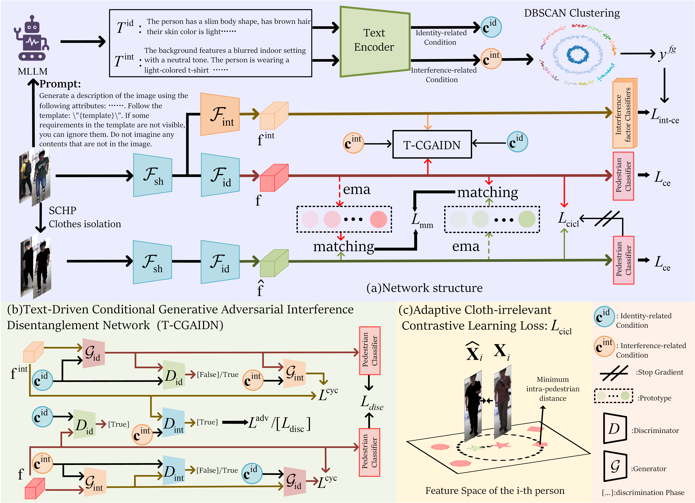

# IIFR-CCReID
# README

## Project Overview
This project contains the code implementation for Isolating Interference Factors for Robust Cloth-Changing Person Re-Identification, which explores Cloth-Changing Person Re-Identification. It provides code for reproducing the experiments presented in the paper.

## Framework Overview
Below is a high-level framework diagram of the proposed method:



## Dependencies
This code runs in the following environment:

- Python Version: 3.8+
- CUDA Version: 11.8+ (for GPU execution)
- Required packages:
  ```bash
  pip install -r requirements.txt
  ```

## Data Preparation
Follow these steps to prepare the dataset:
1. Download the dataset [DeepChange, LTCC, LaST, PRCC, VC-Clothes].
2. Extract the dataset into the `datasets/` directory.
3. Ensure the data is structured as follows:
   ```
   datasets/
   ├── LTCC_ReID/
   ├── LaST/
   ├── prcc/
   ├── VC-Clothes/
   ```

## Running the Code
### Train the Model
```bash
sh train.sh
```

### Evaluate the Model
```bash
sh run.sh
```

### Generate Adversarial Samples (if applicable)
```bash
python generate.py --input path/to/image --output path/to/save
```


## Citation
If you find this project useful for your research, please cite our paper:
```
@inproceedings{li2024disentangling,
  title={Disentangling Identity Features from Interference Factors for Cloth-Changing Person Re-identification},
  author={Li, Yubo and Cheng, De and Fang, Chaowei and Jiao, Changzhe and Wang, Nannan and Gao, Xinbo},
  booktitle={Proceedings of the 32nd ACM International Conference on Multimedia},
  pages={2252--2261},
  year={2024}
}
```
